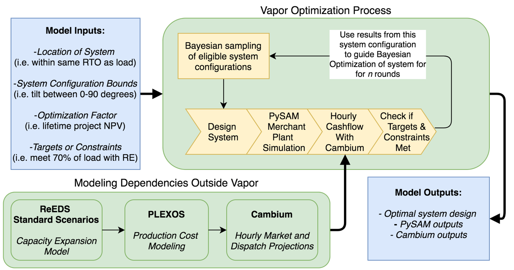
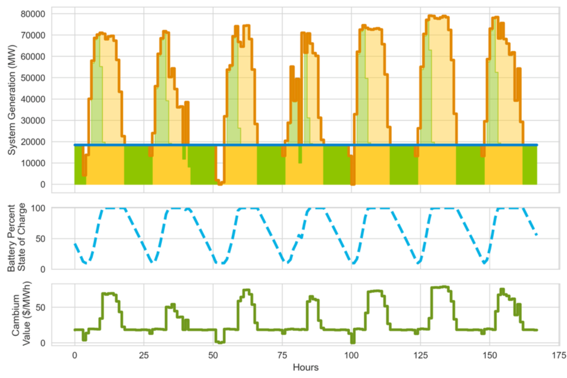

# Voluntary Actor Procurement Optimizer (vapor)

## Introduction
Vapor seeks to optimize renewable energy system siting, design, and (when relevant) battery dispatch behavior of simulated renewable energy systems. 

Vapor uses input from several existing NREL developed models including Cambium and ReEDS. When complete, Vapor will be able to estimate the economically optimal renewable energy system for a voluntary actor to procure within a given set of constraints (geographic, goal oriented, cost) that will provide the most value (in terms of customer value, grid value, or emission reductions) based on an hourly analysis across the entire system’s lifetime. 

## Running Vapor
`run_cli.py` provides a high level interface to run vapor in three modes:
- *Existing*: a simulation of the grid impacts of existing known voluntary procurements in the United States from Bloomberg New Energy Finance's PPA database. 
- *Regional*: find the optimal system configuration in each region (i.e. inter, census_region, state, pca) of a fixed system size. Vapor will independently optimize each system and return the best in each geography. 
- *Constraint*: Given an annual volume of load, and a voluntary target (i.e. 50% of annual energy consumption, or 75% of hourly energy consumption) ,  vapor will optimize for the most economic system size. 

```
# find the lowest cost PV system in each census region that meets at least 50% of hourly energy. 

python run_cli.py --scenario=StdScen19_Mid_Case --tech=pv --opt_var=adjusted_installed_cost --aggregate_region=census_reg --mode=constrain --goal_pct=50 --goal_type=Hourly

# find the lowest marginal cost wind system in each state with a 100 MW size. 

python run_cli.py --scenario=StdScen19_Mid_Case --tech=wind --opt_var=marginal_cost_mwh --aggregate_region=state --mode=regional
```

`run_batch_regional.py` and `run_batch_constraint.py` offer multi-node scenario runs on SLURM based HPC systems. Additional compatibility is under development for running batch jobs. 

## About the Optimization Process




## *Documentation in progress...*